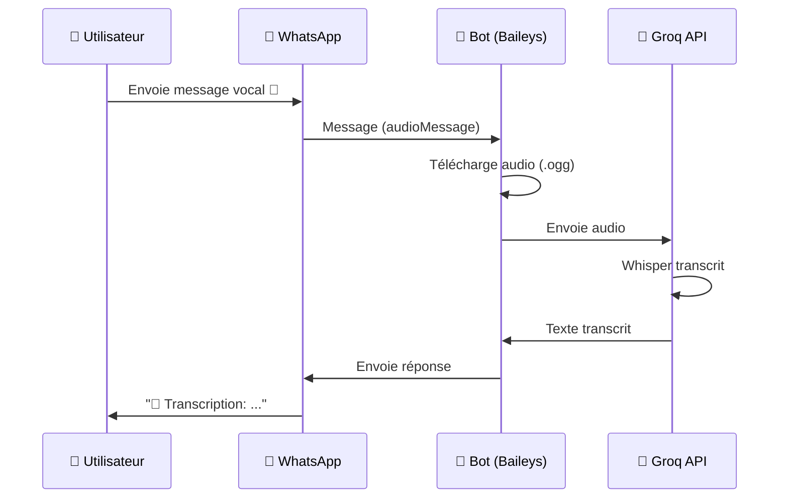
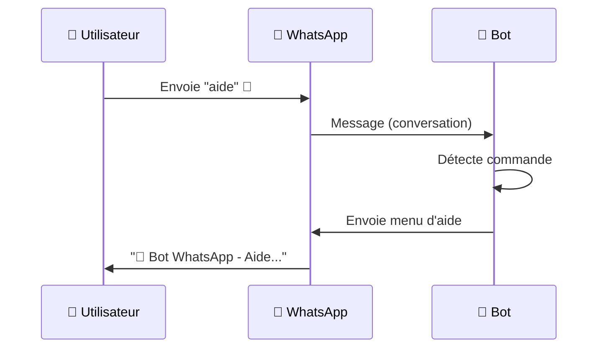

# 🏗️ Architecture du Bot WhatsApp

## Vue d'Ensemble

Ce bot WhatsApp permet de :

- 🎤 Transcrire des messages vocaux en texte
- 💬 Répondre aux messages texte
- 📷 Détecter les images, documents, etc.
- 📄 (Prévu) Générer des factures PDF
- 📧 (Prévu) Envoyer des emails

---

## 📊 Diagramme d'Architecture

```
┌─────────────────────────────────────────────────────────────────┐
│                        UTILISATEUR                               │
│                     (Téléphone WhatsApp)                         │
└─────────────────────────┬───────────────────────────────────────┘
                          │
                          │ Message (vocal/texte/image...)
                          ▼
┌─────────────────────────────────────────────────────────────────┐
│                    SERVEURS WHATSAPP                             │
│               (Infrastructure Meta/WhatsApp)                     │
└─────────────────────────┬───────────────────────────────────────┘
                          │
                          │ Protocole WhatsApp Web (WebSocket)
                          ▼
┌─────────────────────────────────────────────────────────────────┐
│                        TON MAC                                   │
│  ┌───────────────────────────────────────────────────────────┐  │
│  │                   BOT NODE.JS                              │  │
│  │                                                           │  │
│  │  ┌─────────────┐    ┌─────────────┐    ┌─────────────┐   │  │
│  │  │   Baileys   │───▶│  Détecteur  │───▶│  Handlers   │   │  │
│  │  │  (WhatsApp) │    │  de Type    │    │  Spécifiques│   │  │
│  │  └─────────────┘    └─────────────┘    └──────┬──────┘   │  │
│  │                                               │          │  │
│  │        ┌──────────────────────────────────────┼─────┐    │  │
│  │        ▼                    ▼                 ▼     │    │  │
│  │  ┌──────────┐      ┌──────────┐       ┌──────────┐  │    │  │
│  │  │  Audio   │      │  Texte   │       │  Autres  │  │    │  │
│  │  │ Handler  │      │ Handler  │       │ Handler  │  │    │  │
│  │  └────┬─────┘      └────┬─────┘       └────┬─────┘  │    │  │
│  │       │                 │                  │        │    │  │
│  └───────┼─────────────────┼──────────────────┼────────┘    │  │
│          │                 │                  │             │  │
│          ▼                 │                  │             │  │
│   ┌─────────────┐          │                  │             │  │
│   │ Groq Whisper│          │                  │             │  │
│   │     API     │          │                  │             │  │
│   │(Transcription)         │                  │             │  │
│   └──────┬──────┘          │                  │             │  │
│          │                 │                  │             │  │
│          ▼                 ▼                  ▼             │  │
│   ┌─────────────────────────────────────────────────┐       │  │
│   │              RÉPONSE WHATSAPP                   │       │  │
│   │         (Texte formaté envoyé à l'user)         │       │  │
│   └─────────────────────────────────────────────────┘       │  │
└─────────────────────────────────────────────────────────────────┘
```

---

## 📁 Structure des Fichiers

```
bot/
├── .env                      # 🔐 Variables d'environnement (secrets)
├── .gitignore                # 🚫 Fichiers à ignorer par Git
├── package.json              # 📦 Dépendances npm
├── README.md                 # 📖 Documentation utilisateur
│
├── src/                      # 💻 CODE SOURCE
│   ├── index.js              # 🚀 Point d'entrée principal
│   │                         #    - Démarre le bot
│   │                         #    - Définit les handlers
│   │
│   ├── whatsapp/
│   │   └── client.js         # 📱 Client WhatsApp (Baileys)
│   │                         #    - Connexion via QR code
│   │                         #    - Réception des messages
│   │                         #    - Détection du type
│   │                         #    - Routage vers handlers
│   │
│   ├── transcription/
│   │   └── whisper.js        # 🎤 Transcription audio
│   │                         #    - Appel API Groq
│   │                         #    - Modèle Whisper
│   │
│   ├── invoice/              # 📄 (Module factures - prévu)
│   │   ├── parser.js         #    - Extraction données
│   │   └── generator.js      #    - Génération PDF
│   │
│   └── email/                # 📧 (Module email - prévu)
│       └── sender.js         #    - Envoi via Gmail
│
├── auth/                     # 🔑 Session WhatsApp (auto-généré)
│   └── creds.json            #    - Credentials de session
│
├── temp/                     # 📂 Fichiers temporaires
│   └── voice_*.ogg           #    - Audios en cours de traitement
│
└── invoices/                 # 📄 PDFs générés (prévu)
```

---

## 🔧 Technologies Utilisées

### 1. Baileys - Client WhatsApp

```
📦 @whiskeysockets/baileys
```

**Qu'est-ce que c'est ?**

- Librairie open-source qui permet de se connecter à WhatsApp
- Utilise le même protocole que WhatsApp Web
- Pas besoin de l'API officielle Meta (qui est payante)

**Comment ça fonctionne ?**

```
1. Tu lances le bot
2. Un QR code s'affiche
3. Tu le scannes avec WhatsApp (comme WhatsApp Web)
4. Le bot reçoit tous tes messages en temps réel
5. Il peut aussi envoyer des messages
```

**Avantages :**

- ✅ 100% gratuit
- ✅ Pas de vérification Meta requise
- ✅ Accès à tous les types de messages

**Inconvénients :**

- ⚠️ Non officiel (risque théorique de blocage)
- ⚠️ Utilise ta session WhatsApp

---

### 2. Groq - Transcription IA

```
📦 groq-sdk
```

**Qu'est-ce que c'est ?**

- Service d'IA gratuit et ultra-rapide
- Propose le modèle Whisper (créé par OpenAI) pour la transcription
- ~10x plus rapide que l'API OpenAI directe

**Comment ça fonctionne ?**

```
1. Le bot reçoit un audio WhatsApp (.ogg)
2. Il l'envoie à l'API Groq
3. Groq utilise Whisper pour transcrire
4. Le texte est retourné en ~1-2 secondes
```

**Limites gratuites :**

- ~14,400 requêtes audio/jour
- ~6,000 tokens/minute pour le LLM

---

### 3. Node.js - Runtime

```
📦 Node.js 18+
```

**Qu'est-ce que c'est ?**

- Environnement d'exécution JavaScript côté serveur
- Permet de faire tourner du JS hors du navigateur

**Pourquoi Node.js ?**

- Baileys est écrit en JavaScript
- Asynchrone par nature (parfait pour les I/O)
- Écosystème npm riche

---

### 4. Autres Dépendances

| Package | Rôle |
|---------|------|
| `dotenv` | Charge les variables d'environnement depuis `.env` |
| `pino` | Logger performant (utilisé par Baileys) |
| `qrcode-terminal` | Affiche le QR code dans le terminal |
| `pdfkit` | Génération de PDFs (pour les factures) |
| `nodemailer` | Envoi d'emails via SMTP |

---

## 🔄 Flux de Données

### Message Vocal → Transcription



### Message Texte → Réponse



---

## 🔐 Sécurité

### Variables d'Environnement (.env)

```env
# Ne JAMAIS commiter ce fichier !

GROQ_API_KEY=gsk_xxx          # Clé API Groq
EMAIL_USER=xxx@gmail.com      # Email expéditeur
EMAIL_APP_PASSWORD=xxxx       # Mot de passe application Gmail
```

### Session WhatsApp (auth/)

- Contient les clés de chiffrement de ta session
- Si quelqu'un obtient ce dossier, il peut utiliser ton WhatsApp
- Protéger comme un mot de passe !

---

## 🔌 Points d'Extension

Le bot est conçu pour être extensible. Tu peux ajouter :

### 1. Nouveaux Handlers de Messages

```javascript
// Dans src/index.js
async function handleImage({ sender, imageBuffer, caption, socket }) {
  // Ton code pour traiter les images
  // Ex: OCR, analyse IA, etc.
}

createWhatsAppClient({
  onAudio: handleAudio,
  onText: handleText,
  onImage: handleImage,  // ← Ajouter ici
});
```

### 2. Intégration IA (ChatGPT, Claude...)

```javascript
// Ajouter dans handleText()
const response = await callOpenAI(text);
await sendWhatsAppMessage(socket, sender, response);
```

### 3. Base de Données

```javascript
// Sauvegarder les transcriptions
import { createClient } from '@supabase/supabase-js';
const supabase = createClient(url, key);

await supabase.from('transcriptions').insert({
  sender: senderNumber,
  text: transcription,
  created_at: new Date()
});
```

---

## 📈 Limites et Quotas

| Service | Limite Gratuite | Suffisant pour... |
|---------|-----------------|-------------------|
| Groq Whisper | ~14,400 req/jour | ~600 audios/heure |
| Groq LLM | ~6,000 tokens/min | ~100 requêtes/min |
| Gmail | 500 emails/jour | Usage personnel |
| Baileys | Illimité | Usage 24/7 |

---

## ❓ FAQ

**Q: Le bot fonctionne-t-il 24/7 ?**
A: Oui, tant que ton Mac reste allumé et connecté à Internet.

**Q: Puis-je utiliser un autre numéro WhatsApp ?**
A: Oui, scanne le QR code avec n'importe quel numéro.

**Q: WhatsApp peut-il me bloquer ?**
A: Théoriquement oui (usage non officiel), mais rare avec un usage normal.

**Q: Comment déployer en production ?**
A: Tu peux déployer sur un VPS (DigitalOcean, Railway, etc.) avec Node.js.
